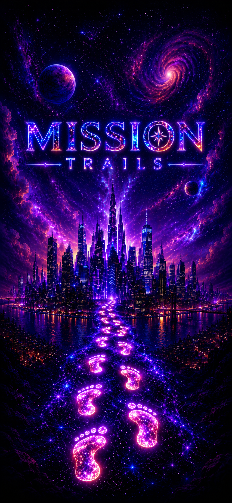

# MissionTrail-2.0

  

  <strong>CHART YOUR JOURNEY. EXPLORE YOUR WORLD.</strong>

---

## About Mission Trails

Mission Trails is a location-based exploration and fitness mobile application designed to turn real-world movement into an interactive adventure.

The app is built around the idea that fitness should feel exciting, rewarding, and social instead of repetitive. Instead of only tracking steps, calories, or workout numbers, Mission Trails uses movement as part of a larger exploration system. Users walk, explore, complete missions, unlock collectibles, level up companions, and build progress through outdoor activity.

Mission Trails is designed to motivate users to move more by giving them a reason to explore the world around them.

---

## What the App Does

Mission Trails allows users to turn everyday walking and outdoor movement into a game-like experience. When users open the app, they can access missions, track their movement, view their live location, and explore areas around them through an interactive map system.

As users walk, the app can track their movement through GPS and display glowing trails that show where they have traveled. These trails help users visualize their routes, distance, and exploration history in a more exciting way than a normal fitness tracker.

The app also includes missions that give users objectives to complete while moving outdoors. These missions can reward users with XP, collectibles, companion progress, badges, and other unlockable rewards. This gives users a stronger reason to stay active and continue exploring.

Mission Trails also includes companion systems. Users can unlock companions, level them up, customize them, and evolve them through activity and mission completion. The more users explore and complete objectives, the more their companion grows with them.

Collectibles are another major part of the app. Users can discover items, rewards, and rare collectibles while exploring different locations. These collectibles can be stored in an inventory system and may later support rarity levels, trading, event rewards, and special unlocks.

The app also supports social interaction. Users can add friends, compare progress, invite others to missions, view leaderboard rankings, and participate in community challenges. This turns outdoor movement into a shared experience instead of something users do alone.

---

## Main App Systems

Mission Trails is planned around several connected systems:

- A splash screen that introduces the Mission Trails brand.
- A login and signup system for secure user accounts.
- A home mission hub where users can view progress and start missions.
- A live map that tracks real-time GPS movement.
- A glowing trail system that shows where users have walked.
- A mission system that gives users objectives and rewards.
- A companion system for leveling, evolution, and customization.
- A profile screen for user stats, progress, achievements, and activity.
- An inventory system for collectibles, rewards, and unlocked items.
- A leaderboard system for XP, mission rankings, and seasonal events.
- A friends and chat system for social interaction.
- A trading system for exchanging collectibles and rewards.
- Future support for AR features, live events, and multiplayer exploration.

---

## User Experience

The visual style of Mission Trails is designed to feel futuristic, dark, glowing, and immersive. The app uses neon colors, rounded interface elements, animated screens, glowing effects, and a sci-fi exploration theme.

The goal is to make the app feel more like an adventure game than a basic fitness tracker. Screens are designed to feel clean but exciting, with a strong focus on movement, progression, missions, and discovery.

The live map is one of the most important screens in the app. It is intended to show the user’s real-time movement, glowing walking trails, nearby collectibles, active missions, and other player activity.

---

## Purpose of the App

Mission Trails is made for people who want fitness to feel more engaging. Many people lose motivation with normal fitness apps because the experience becomes repetitive. Mission Trails solves that problem by connecting movement to rewards, exploration, progression, and social interaction.

The app encourages users to:

- Walk more often.
- Explore outdoor spaces.
- Complete goals and missions.
- Build healthy habits.
- Unlock rewards through activity.
- Interact with friends.
- Stay motivated through progression systems.

Instead of asking users to put their phones away, Mission Trails uses the phone as a tool to encourage healthier real-world movement.

---

## Future Vision

Future versions of Mission Trails may include augmented reality companion interactions, 3D collectibles, companion battles, live multiplayer missions, hidden locations, seasonal events, voice chat, advanced movement statistics, heatmaps, and larger community-based challenges.

The long-term goal is to create a mobile experience that combines fitness, exploration, gaming, and social interaction into one connected world.

---

## Development Team

Created by:

- Michael Clark  
- Krystal Pereira

MissionTrail-2.0
